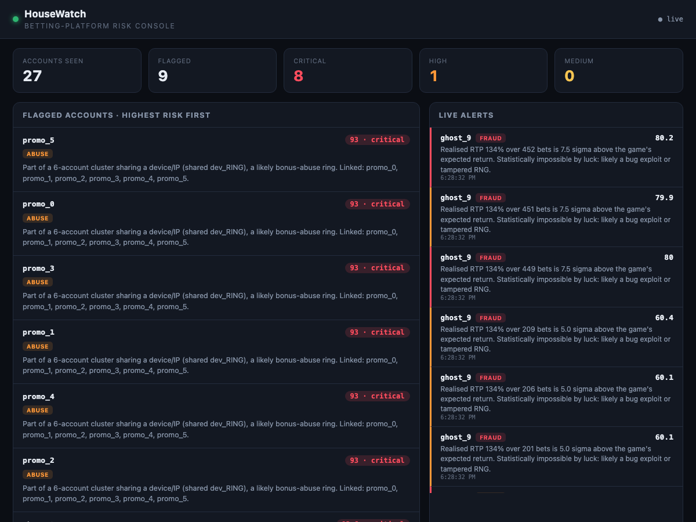

# HouseWatch

A real-time fraud and abuse detection engine for betting platforms. It watches
account and betting activity, scores every account for risk, and shows what it
finds (and why) on a live analyst dashboard.

It's built to defend [FairHouse](https://github.com/Akammina/FairHouse-), a
provably-fair casino: FairHouse forwards its bets to HouseWatch, and an attack
simulator injects synthetic fraud so you can watch the engine catch it live.



## What it detects

| Detector | Catches | How it works |
|----------|---------|--------------|
| **Win-rate anomaly** | cheating / bug exploits | Every game's true RTP and return variance were measured in the FairHouse [math lab](https://github.com/Akammina/FairHouse-/tree/main/math-lab). Given how many bets an account has placed, HouseWatch z-scores its realised return against that. Sitting 6+ sigma above expected isn't luck. |
| **Bot timing** | fast / regular bots | Humans bet irregularly; bots don't. Flags near-constant inter-bet gaps or a superhuman sustained bet rate. |
| **Bot behaviour** | bots that fake human timing | A bot that randomises its delays still can't fake endurance (thousands of bets with no break) or stake variety (the exact same size every time). Neither fires on a human grinder. |
| **Multi-accounting** | rings sharing hardware | Links accounts that share a device fingerprint or IP (union-find over the graph), then flags clusters big enough to be a ring. |
| **Coordinated cohorts** | rings that rotate fingerprints | Rotating device/IP defeats hardware linkage, so this links on *behaviour* instead: accounts that play the same game at the same stake in the same way are a coordinated cohort even with different fingerprints. |
| **Account takeover** | stolen logins | An account with an established history from one device, then a new device that starts betting far larger, is the classic hijack pattern. |
| **IP hopping** | proxy/VPN rotation, shared accounts | One account betting from many different IPs is rotating proxies or being shared. |
| **Loss-chasing** | player harm (responsible gambling) | Measures the *rate* of stake increases right after a loss. A chaser does it almost every time; a player with varied stakes doesn't. |
| **Game integrity** (platform-level) | a compromised RNG | Runs the same z-score on each game's *total* RTP across all players. If a game pays above its designed return across the board, it's broken, no matter who's winning. |

Each account gets a **0-100 risk score** with a severity level and a plain-English
reason for every signal. Explainability is the point: an analyst has to trust why
an account was flagged, not just see a number.

## The signature: catching a cheat with the game's own math

The win-rate detector is the interesting one. Because the math lab measured each
game's expected return and its variance, HouseWatch knows exactly how an honest
player's results should be distributed:

```
expected = sum( stake_i * rtp(game_i) )
variance = sum( (stake_i * return_std(game_i))^2 )     # independent bets
z        = (realised_return - expected) / sqrt(variance)
```

A player 6+ sigma above expected over thousands of bets is exploiting a bug or a
tampered RNG. In the demo, the "cheater" is caught at around 7-9 sigma.

## Architecture

```
FairHouse (betting platform) ──emits bet events──┐
                                                  ▼
Attack simulator ──synthetic fraud──►  POST /ingest
                                                  │
                                          ┌───────▼────────┐
                                          │  risk engine   │  streaming aggregates
                                          │  (detectors +  │  per account (O(1)/event)
                                          │   scoring)     │
                                          └───────┬────────┘
                                                  │ alerts
                                          SSE ────▼────►  live dashboard
```

Services talk over events (an ingest endpoint), not a shared database, so the
platform and the monitor are decoupled. The engine keeps per-account running
aggregates (expected return, variance, inter-bet gaps via Welford) so each event
is scored in O(1) instead of rescanning history.

## Trying to fool it (red-team)

The detectors were built by attacking them. `python -m simulator.redteam` runs a
diverse honest population plus a wide set of attack variants and grades two numbers
at once, because a detector that catches everything by flagging everyone is useless:

```
recall on catchable attacks : 12/12
normal players              : 300  (x4 random seeds)
false positives             : 0
```

Each attack that gets through is labelled as a **fundamental limit**, not hidden. A
tool that claims to catch everything is a red flag; being precise about what it can't
do is the honest (and more useful) position:

| Evasion that gets through | Why, and what would be needed |
|---------------------------|-------------------------------|
| **Stealth cheat** (tiny edge) | A small edge over few bets is below the statistical noise floor. Detection improves as more bets accumulate; it's a data limit, not a bug. |
| **Single-account cheat on a high-variance game** | The variance drowns the signal for one account. Volume or the platform monitor is needed. |
| **Distributed exploit with varied signatures** | Rotating fingerprints *and* varying stake/game per account defeats both hardware and behavioural linkage. Would need a payment/KYC graph. |
| **Human-mimicking bot** (breaks, varied stakes, low volume) | Indistinguishable from a person server-side. Would need client-side behavioural biometrics. |

Each round of red-teaming drove a hardening: bots that fake timing are caught on
endurance and stake uniformity; rings that rotate fingerprints are caught on
behavioural cohorts; distributed cheating is caught by the platform-level monitor.
Layered detection, because any single detector can be evaded.

## Run it

```bash
python3 -m venv .venv && source .venv/bin/activate
pip install -r requirements.txt

pytest                                  # detector + engine tests
uvicorn api.main:app --port 8000        # engine + dashboard at http://localhost:8000
python -m simulator.attack              # inject synthetic traffic + attacks
#   add --delay 0.02 to watch alerts land on the dashboard live
python -m simulator.redteam             # the full red-team + false-positive scorecard
```

Open `http://localhost:8000` and watch the ring, bot, cheater, and chaser get
flagged while the 18 normal players stay clear.

### Wiring in the real platform (optional)

Start FairHouse with `HOUSEWATCH_URL=http://localhost:8000` and it forwards every
real bet to `/ingest` (fire-and-forget: if HouseWatch is down, gameplay is
unaffected).

## API

| Method | Route | Purpose |
|--------|-------|---------|
| POST | `/ingest` | receive a bet event |
| GET | `/stream` | Server-Sent Events: alerts pushed live |
| GET | `/accounts` | flagged accounts, highest risk first |
| GET | `/alerts` | recent alerts |
| GET | `/summary` | headline counts |
| GET | `/` | the dashboard |

## Layout

```
housewatch/
  housewatch/
    events.py            bet event schema
    games.py             per-game RTP + return std (from the math lab)
    store.py             in-memory state + streaming aggregates
    engine.py            runs detectors, combines signals, raises alerts
    detectors/           win_rate, bot_timing, bot_behavior, multi_account,
                         cohort, account_takeover, ip_hopping,
                         responsible, platform
  api/main.py            FastAPI: /ingest, SSE, dashboard
  simulator/
    attack.py            synthetic normal players + attackers
    evade.py             obvious attack vs smart evasion, per detector
    redteam.py           full coverage + false-positive scorecard
  static/dashboard.html  the live analyst console
  tests/                 detector + engine tests
```

## Tech

Python 3 · FastAPI · Server-Sent Events · union-find · online statistics
(Welford, z-scores) · pytest. No heavy ML libraries: the detections are
transparent statistics an analyst can reason about.
